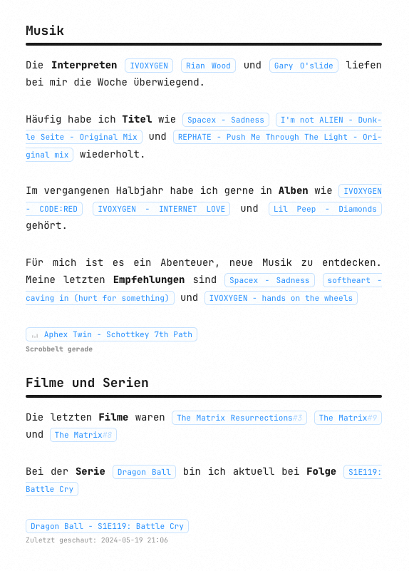

# NowScrobbling (WordPress Plugin)

**NowScrobbling** is a simple and efficient WordPress plugin that allows you to display recent activities from **Last.fm** and **Trakt** on your WordPress site using **shortcodes**. It provides an easy way to showcase your most recent music scrobbles and watched movies or TV shows directly on your posts, pages, or widgets.

## Features

- **Last.fm & Trakt Integration**: Easily display your most recent scrobbles and watched content from Last.fm and Trakt.
- **API Key and Username Management**: Configure your API keys and usernames for Last.fm and Trakt right from the WordPress admin dashboard.
- **Customizable Display Settings**: Adjust the number of top tracks, albums, artists, loved tracks, and recent activities to display.
- **Cache Management**: Control cache duration to reduce API load and improve performance.
- **Shortcode Support**: Use flexible shortcodes to integrate data within posts, pages, or widgets, with the option to define attributes (e.g., number of items to display).

## Installation

1. Upload the `nowscrobbling` folder to the `/wp-content/plugins/` directory of your WordPress installation.
2. Activate the plugin through the 'Plugins' menu in WordPress.

## Configuration

After activation, navigate to `Settings > NowScrobbling` in the WordPress admin dashboard. Here, you can enter your API keys and usernames for Last.fm and Trakt, and customize the display options.

## Usage

You can embed your Last.fm and Trakt activities anywhere on your site using the following shortcodes:

### Last.fm Shortcodes

- `[nowscr_lastfm_indicator]` – Displays the current Last.fm activity status.
- `[nowscr_lastfm_history]` – Displays recent scrobbles from Last.fm.
- `[nowscr_lastfm_top_artists period="7day" limit="5"]` – Displays the top artists for a specified period from Last.fm (e.g., the last 7 days, with a limit of 5 artists).
- `[nowscr_lastfm_top_albums period="7day"]` – Displays the top albums for a specified period from Last.fm.
- `[nowscr_lastfm_top_tracks period="7day"]` – Displays the top tracks for a specified period from Last.fm.
- `[nowscr_lastfm_lovedtracks limit="10"]` – Displays loved tracks from Last.fm (limit to 10).

#### Period Options for Last.fm Shortcodes

The `period` attribute for Last.fm shortcodes can be set to the following values:
- `7day` – Last 7 days
- `1month` – Last 30 days
- `3month` – Last 90 days
- `6month` – Last 180 days
- `12month` – Last 365 days
- `overall` – Overall time period

#### Example: Customizing Shortcodes with Attributes (`$atts`)

You can define custom settings directly in the shortcode using **attributes**. For example:

- `[nowscr_lastfm_top_tracks period="1month" limit="10"]` – Displays the top 10 tracks from the last month.
  
In this example:
- `period="1month"` defines the time range for the data.
- `limit="10"` restricts the output to 10 items.

These attributes are handled internally by WordPress via the `$atts` array, which passes user-defined parameters to the plugin. If no attributes are specified, default values are used.

### Trakt.tv Shortcodes

- `[nowscr_trakt_indicator]` – Displays the current Trakt activity status.
- `[nowscr_trakt_history]` – Displays recent activities from Trakt.
- `[nowscr_trakt_last_movie limit="3"]` – Displays the last watched movies from Trakt (limit to 3).
- `[nowscr_trakt_last_movie_with_rating]` – Displays the last watched movies with ratings from Trakt.
- `[nowscr_trakt_last_show limit="5"]` – Displays the last watched shows from Trakt (limit to 5).
- `[nowscr_trakt_last_episode]` – Displays the last watched episodes from Trakt.

#### Example: Trakt Shortcode with Attributes

- `[nowscr_trakt_last_movie_with_rating limit="5"]` – Displays the last 5 watched movies from Trakt, including their ratings.
  
In this example:
- `limit="5"` restricts the number of displayed movies to 5.
- `show_rating="true"` would enable the display of ratings if this attribute is available.

## Customization

The appearance of the displayed data can be customized with CSS. Relevant CSS classes are documented in the plugin’s source code to help you fine-tune the look and feel.

## Contributing

We welcome contributions! If you'd like to contribute to improving NowScrobbling, feel free to fork the repository, submit pull requests, or report issues on GitHub.

## Support

For support, please visit [https://robinwill.de](https://robinwill.de) or open an issue on GitHub.

## Frequently Asked Questions (FAQ)

### How do I get my Last.fm API Key?

To get a Last.fm API key, visit [Last.fm API Documentation](https://www.last.fm/api) and follow the instructions to create an API key.

### How do I get my Trakt Client ID?

To get a Trakt Client ID, visit [Trakt API Documentation](https://trakt.docs.apiary.io/) and follow the steps to create a new application and obtain a Client ID.

## License

This plugin is licensed under the GPL v2 or later. See the [LICENSE](LICENSE) file for more details.
